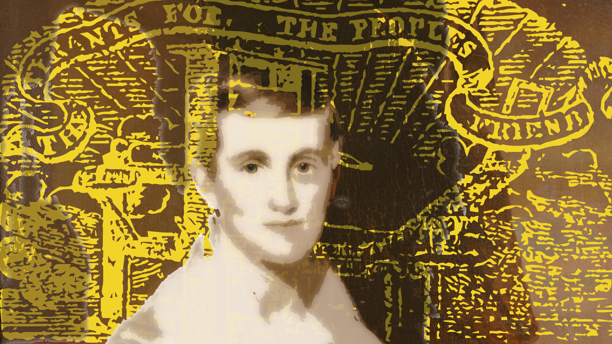

  

<h3>Connecticut's First Immediate Abolitionist Newspaper</h3>

<em>The Unionist</em> was established in 1833 in Brooklyn, Connecticut to serve as a local voice in support of Abolition, Prudence Crandall, and the Canterbury Female Academy. It was birthed in a conversation between the Unitarian minister and Abolitionist Samuel J. May and New York Abolitionist and wealthy merchant Arthur Tappan. The man selected to edit it - Charles C. Burleigh - was ready to lead this venture due to his triple training in law, journalism, and the fervid moral reform movements of the era. The paper ran from August of 1833 through September of 1834. Charles Burleigh's brother William Burleigh became a co-editor by the end of 1833, as well as being an associate teacher at the Canterbury Female Academy - New England's first Academy for African-American women. <em>The Unionist</em> was active during all four of the legal actions taken against Crandall and the Academy, which expanded its importance regionally. <em>The Unionist</em> is the earliest documented newspaper in support of Immediate Abolition to be published in Connecticut.

Only five of the approximate number of sixty complete issues have been preserved. The nineteenth-century practice of copying and crediting articles from other papers though has yielded content from another eighteen issues. The goal of this website is to render <em>The Unionist</em> Unified, and make it available to scholars and general readers at this historical moment of reckoning. The attached content analysis also suggests that <em>The Unionist</em> was a considerable philosophic and political achievement of its own.

  There are five extant complete issues of <em>The Unionist</em> in three storied archives, as listed below:

<ol>
<li><a href="explore/issues/?issue=2">August 8, 1833, Issue 2</a> – New-York Historical Society Library
    </li>
 <li><a href="explore/issues/?issue=6">September 5, 1833, Issue 6</a> – American Antiquarian Society
    </li>
<li><a href="explore/issues/?issue=20">December 9, 1833, Issue 20</a> – Library of Congress
    </li>
<li><a href="explore/issues/?issue=32">March 13, 1834, Issue 32</a> – New-York Historical Society Library
    </li>
<li><a href="explore/issues/?issue=36">April 10, 1834, Issue 36</a> – Library of Congress
    </li>
  </ol>

<a class='card-link' href="explore/">
  

    <h3 class="card-header">Featured Content</h3>
      

      Featured content, edited in index.md
      

    

    </a>

    <a class='card-link' href="map/">
      

        <h3 class="card-header">Map <em>The Unionist's</em> Influence</h3>
          

          Newspapers from Philadelphia to Vermont reprinted articles from <em>The Unionist</em> for their readers. Follow the spread of Unionist content throughout the Northeast.
          

        

      </a>

  <iframe src='https://cdn.knightlab.com/libs/timeline3/latest/embed/index.html?source=1LGO_ZD9m2V5kgSCLLs97D_Q7tqQlryK-mfkm6iFKCf0&font=Default&lang=en&initial_zoom=2&height=650' width='100%' height='650' webkitallowfullscreen mozallowfullscreen allowfullscreen frameborder='0'></iframe>

There is some confusion about both the starting and the end dates of the brief
life of <em>The Unionist.</em>. Some sources claim it had been launched by the end of July 1833, but by its own
numbering, issue 1:1 would have been dated August 1, 1833. The final issues
of <em>The Unionist</em> are shrouded in even deeper mystery. By July of 1834 Charles Burleigh
had grown restless in the editorial chair. Yet there is strong evidence that the
paper continued to publish through that month. There is one story from the close
of the Canterbury Academy, in September of 1834, but there was also a
publication that claimed <em>the Unionist</em> had been taken over by a non-abolitionist editor. In the absence of more
evidence, for now we cannot be certain if <em>The Unionist</em>
in its Abolitionist form was publishing in August and September of 1834.
In any case, after September 1834, when the Canterbury Female Academy closed due to vigilante violence, its function as a mouthpiece for
pro-Abolitionist perspectives in northeastern Connecticut had become moot. I
have been unable to find any scrap of evidence of the paper's existence from
October 1834 forward, and both Charles and William Burleigh had left the area by the end of 1834.

The full contents of <em>The Unionist</em>, and various contemporaneous commentary about <em>The Unionist</em> are present in this project. They are divided into five categories. These are 

 <ol>
  <li>Trial Transcripts and Outstanding Content from <em>The Unionist</em></li>
  <li>Complete Issues of <em>The Unionist</em></li>
  <li>Republished <em>Unionist</em> content</li>
  <li>Positive Notice of <em>The Unionist</em></li>
  <li>Critical Notice of <em>The Unionist</em></li>
